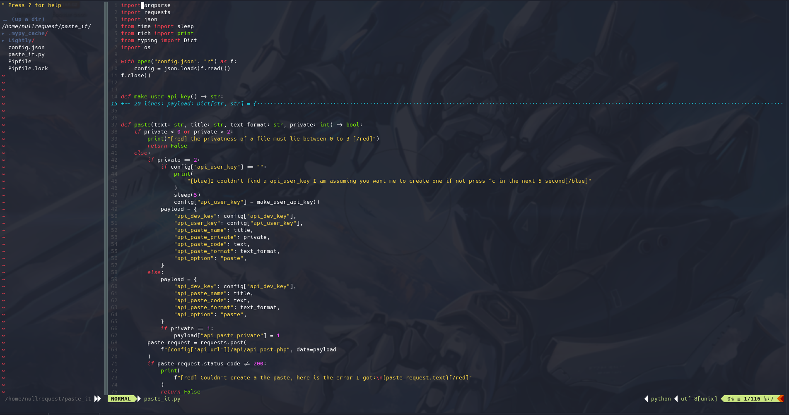
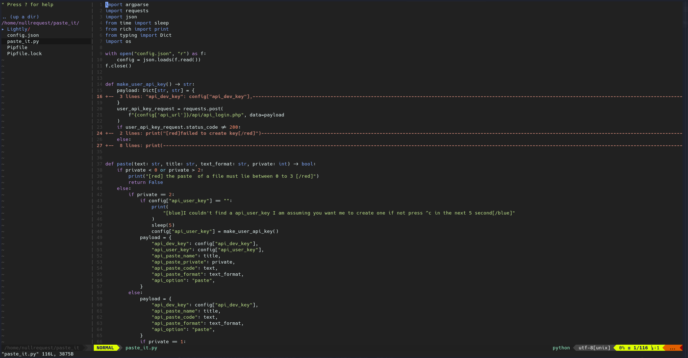
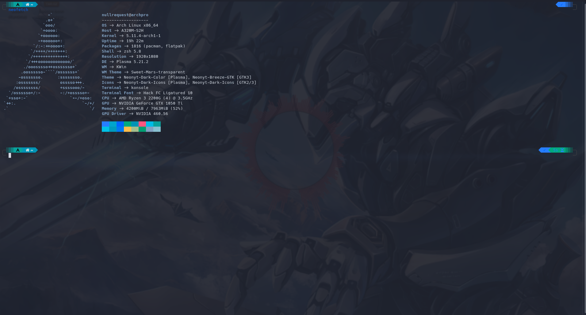

# Nullrequest's dotfiles
This a little repo I made to store my dotfiles. this is can be used alone or with my [auto-init](https://github.com/advaithm/auto_init) script, The auto-init script setups my development environment on Kde Plasma. The script installs my favorite theme, sets my [wallpaper](https://twitter.com/KleinesGluck/status/1336052912594722816) and my uses stow to set up my dotfiles. You will need to following installed to allow you to use all the dotfiles here.
```
vim
neovim
zsh
neofetch
```
You can use only one or two depending on what you like. This repo is intended to be used with [gnu stow](https://www.gnu.org/software/stow/) a nifty program that symlinks these files to the appropriate locations. To create these symlinks all you need to do is
```bash
stow vim neofetch vscode zsh
```
Stow will do the rest and create the symlinks. For vim/neovim you will need to run the following to ensure everything works
```bash
git clone https://github.com/kristijanhusak/vim-packager ~/.vim/pack/packager/opt/vim-packager
git clone https://github.com/kristijanhusak/vim-packager ~/.config/nvim/pack/packager/opt/vim-packager
```
If you used the auto-init script I created you only need to do the following step. Then finally in vim and nvim run `PackagerInstall` or `PackagerUpdate` on first run to sync all the dependencies required. I've taken some screen shots of how everything looks once installed.

where did the vscode/vscodium dotfiles go!!, well I've been working on moving to other texteditors due to the anti-user practices Microsoft has been pulling with plugins like Pylance. I removed it for those reasons. I also accidently commited some tokens in the settings.json so I purged it from the repo. I am not really interested in publishing a version that fixes this.


- [Neovim](https://neovim.io/) 

- [vim](https://www.vim.org/)

- [neofetch](https://github.com/dylanaraps/neofetch)+[zsh](https://www.zsh.org/)

